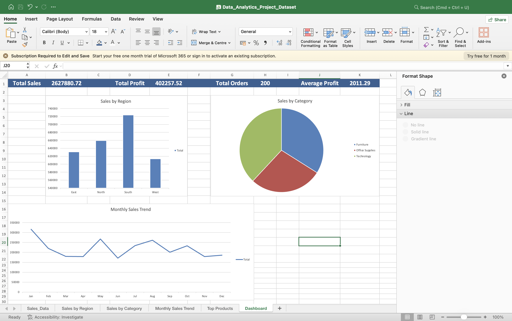
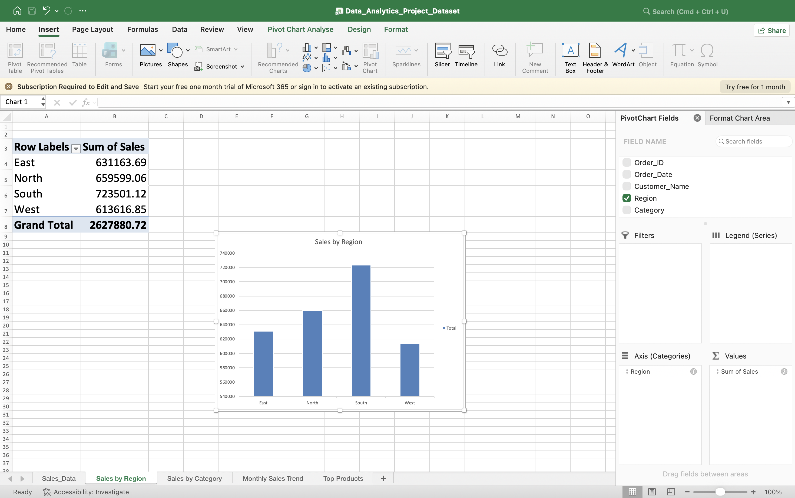
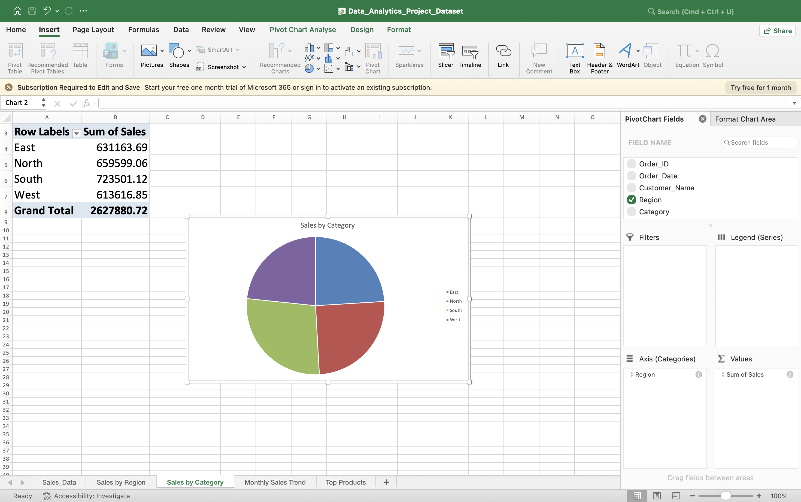
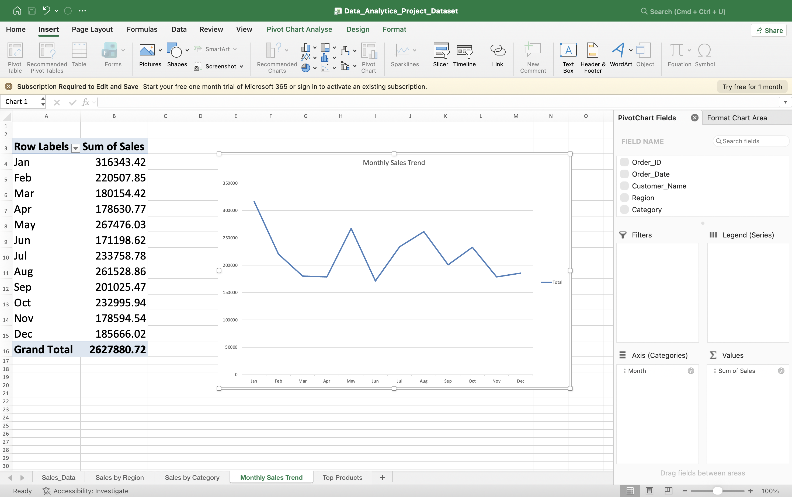

# 📊 Sales Performance Analytics Dashboard (Excel)

## Project Overview
This project is an interactive Sales Performance Analytics Dashboard built in Microsoft Excel. It helps analyze sales performance, profit trends, regional performance, product-wise sales, and category insights using Pivot Tables, Pivot Charts, and KPI metrics.

## Dashboard Highlights
## Dashboard Preview

## Sales by Region

## Sales by Category

## Monthly Sales Trend

### Key Performance Indicators (KPIs)
- Total Sales: ₹26,27,880.72
- Total Profit: ₹4,02,257.52
- Total Orders: 200
- Average Profit per Order: ₹2,011.29

### Analysis Performed
- Sales by Region
- Sales by Category
- Monthly Sales Trend
- Top Performing Products
- Profit Analysis
- Interactive Dashboard Design

## Tools & Techniques Used
- Microsoft Excel
- Pivot Tables
- Pivot Charts
- Data Cleaning
- Data Visualization
- Dashboard Design
- KPI Reporting

## Business Insights
- South Region generated the highest revenue.
- Technology category contributed the highest sales.
- Monthly sales trends helped identify peak-performing periods.
- Product-level analysis highlighted best-selling products.

## Project Files
- Data_Analytics_Project_Dataset.xlsx
- Sales_Performance_Analytics_Project_Report.pdf

## Author
**Piyush Dubey**
B.Tech CSE | Data Analytics Enthusiast

GitHub: https://github.com/piyushdubey26
LinkedIn: https://www.linkedin.com/in/piyush-dubey-70183429a
